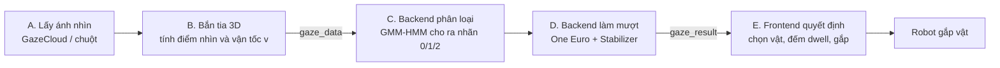
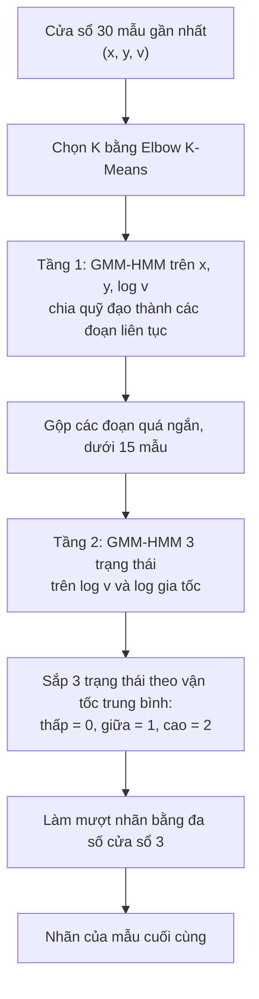

# MIDAS TOUCH 3D — HỆ THỐNG HOẠT ĐỘNG NHƯ THẾ NÀO

> Tài liệu này giải thích từng bước từ lúc mắt bạn nhìn vào màn hình cho đến lúc cánh tay robot gắp vật.
> Cách đọc: phần 1–3 để nắm bức tranh lớn, phần 4 để hiểu từng thuật toán, phần 5–8 để tra cứu.

**Độ tin cậy của tài liệu:** nội dung dưới đây đối chiếu với các file `main.py`, `classifier_service.py`, `notebook_classifier.py`, `Scene3D.tsx`, `useGazeStore.ts`, `OverlayUI.tsx`, `GazeCloudManager.tsx` và bản patch `gaze_filter.py`. Những chỗ chưa kiểm chứng được bằng code được đánh dấu ⚠️ (xem mục 9).

---

## 1. BÀI TOÁN: "MIDAS TOUCH" LÀ GÌ?

Điều khiển bằng mắt có một vấn đề: **mắt vừa để nhìn, vừa để ra lệnh**. Nếu hệ thống cứ nhìn vào đâu là kích hoạt đó, bạn chỉ cần đảo mắt khám phá cảnh là robot gắp loạn xạ (giống vua Midas chạm vào đâu cũng hoá vàng).

**Ý tưởng giải quyết:** không phải "nhìn vào vật" là gắp, mà chỉ gắp khi mắt **đứng yên có chủ đích** (Fixation) đủ lâu trên vật. Mắt đang lướt hay đang nhảy thì bỏ qua.

Vì vậy hệ thống cần trả lời 2 câu hỏi liên tục, mỗi khung hình:

| Câu hỏi | Ai trả lời | Bằng cách nào |
|---|---|---|
| **Mắt đang nhìn vào đâu?** | Frontend + bộ lọc | Tọa độ gaze → làm mượt → bắn tia 3D |
| **Mắt đang làm gì?** (đứng yên / trượt / nhảy) | Backend | Mô hình GMM-HMM đọc vận tốc mắt |

Gắp chỉ xảy ra khi câu trả lời là: *"đang nhìn vào hộp đỏ"* **và** *"mắt đang đứng yên"* trong **800 ms**.

---

## 2. BỨC TRANH TỔNG THỂ



Năm giai đoạn, nói ngắn gọn:

- **A. Lấy ánh nhìn:** SDK GazeCloud dùng webcam, trả về điểm nhìn trên màn hình, đổi sang tọa độ NDC (xem bảng dưới).
- **B. Bắn tia 3D:** từ camera 3D bắn một tia qua điểm nhìn, xem tia chạm vào đâu trên bàn. Từ điểm chạm đó tính ra vận tốc `v`.
- **C. Phân loại hành vi:** backend nhìn 30 mẫu gần nhất, GMM-HMM quyết định mắt đang Fixation, Smooth Pursuit hay Saccade.
- **D. Làm mượt:** lọc nhiễu để điểm nhìn không rung.
- **E. Quyết định:** frontend chọn vật đang được nhìn, đếm thời gian, đủ điều kiện thì gắp.

### ⚠️ Điều quan trọng nhất cần nhớ: có HAI hệ tọa độ khác nhau

Đây là chỗ dễ nhầm nhất khi đọc code.

| | Tọa độ **NDC màn hình** | Tọa độ **mặt bàn chuẩn hoá** |
|---|---|---|
| Là gì | Điểm nhìn trên màn hình, mỗi trục từ −1 đến +1 | Điểm tia chạm xuống mặt bàn y=0, đổi về 0…1 |
| Gửi lên backend dưới tên | `nx, ny` | `x, y` (và `v` tính từ đây) |
| Dùng để | Bắn tia, vẽ crosshair, chọn vật | **Cho GMM-HMM phân loại** |
| Được làm mượt bởi | `GazeSmoother` (One Euro + Stabilizer) | `EyeCursorController` (buffer / EMA) |

Hai đường này chạy song song. Phân loại hành vi dùng đường bên phải, còn việc "nhìn vào đâu" dùng đường bên trái.

---

## 3. ĐI THEO MỘT VÍ DỤ CỤ THỂ

Bạn nhìn hộp đỏ, giữ mắt khoảng 1 giây, rồi hộp bị gắp.

| Thời điểm | Điều xảy ra |
|---|---|
| t = 0 | Mắt đang lướt trong cảnh. Nhãn = 1 (Pursuit). Dwell **không** đếm. |
| t = 0.3 s | Mắt nhảy tới hộp đỏ (Saccade, nhãn 2). Con trỏ nhảy tức thì sang hộp. Chưa đếm. |
| t = 0.4 s | Mắt bắt đầu đứng yên. Backend thấy 4 mẫu liên tiếp là Fixation, nhãn chính thức chuyển thành 0. |
| t = 0.4 → 1.2 s | Tia trúng hộp đỏ **và** nhãn = 0, dwell đếm từ 0 lên 800 ms. Vòng tròn tiến độ quanh crosshair đầy dần. |
| t = 0.7 s | Webcam rung, tia lệch khỏi hộp 100 ms. Do có **ân hạn 300 ms** nên tiến độ chỉ tạm dừng, không mất. |
| t = 1.2 s | Dwell đạt 800 ms, hộp chuyển xanh lá, cánh tay robot di chuyển tới phía trên hộp. |

Nếu ở t = 0.7 s bạn nhìn đi chỗ khác luôn, quá 300 ms thì tiến độ giảm dần về 0 và không gắp. Đó chính là cơ chế chống Midas Touch.

---

## 4. TỪNG THUẬT TOÁN, GIẢI THÍCH CHI TIẾT

### 4.1. Từ điểm nhìn đến tia 3D và vận tốc (frontend, `GazeController`)

1. **Lấy NDC.** `GazeCloudManager` đổi pixel sang NDC:
   `ndcX = docX / chiều_rộng × 2 − 1`, `ndcY = −docY / chiều_cao × 2 + 1`.
2. **Bắn tia.** `raycaster.setFromCamera(ndc, camera)` tạo một tia từ camera xuyên qua điểm nhìn. (Việc "NDC → hướng 3D" ở đây thay cho các bước chuẩn hoá camera trong tài liệu hiệu chuẩn tay–mắt của robot thật; trong mô phỏng, độ sâu có sẵn nhờ cảnh 3D.)
3. **Tìm điểm chạm.** Nếu tia trúng vật có `userData.isTarget` thì lấy điểm chạm đó. Nếu không trúng vật nào thì lấy giao điểm của tia với mặt bàn (y = 0).
4. **Chuẩn hoá về 0…1.** `normX = (x + 5) / 10`, `normY = (z + 5) / 10` (bàn rộng 10 đơn vị).
5. **Tính vận tốc.** `v = khoảng_cách(điểm_nay, điểm_trước) / Δt`, đơn vị là "đơn vị chuẩn hoá / giây".

Hai tham số `x, y` và `v` này được gửi lên backend cùng timestamp và (khi có mẫu webcam mới) cả `nx, ny`.

---

### 4.2. Phân loại hành vi bằng GMM-HMM (backend, `notebook_classifier.py`)

#### Trực giác

Mắt người chỉ có 3 kiểu chuyển động chính, mỗi kiểu có "nhịp vận tốc" riêng:

| Nhãn | Hành vi | Vận tốc điển hình | Ý nghĩa với robot |
|---|---|---|---|
| 0 | **Fixation** — mắt đứng yên nhìn | Thấp | Có thể là ý định gắp |
| 1 | **Smooth Pursuit** — mắt trượt mượt theo thứ gì đó | Trung bình | Bỏ qua |
| 2 | **Saccade** — mắt nhảy nhanh sang chỗ khác | Cao | Bỏ qua |

**HMM (Hidden Markov Model)** coi 3 hành vi này là 3 *trạng thái ẩn*. Ta không quan sát được trạng thái trực tiếp, chỉ quan sát được vận tốc. HMM học hai thứ:

- Mỗi trạng thái "sinh ra" vận tốc theo phân phối nào (đây là phần **GMM**, hỗn hợp Gaussian).
- Từ trạng thái này sang trạng thái khác dễ hay khó (ví dụ Fixation hiếm khi chuyển thẳng sang Pursuit, nên chuỗi nhãn ít bị nhấp nháy hơn so với chỉ dùng ngưỡng).

Ưu điểm so với ngưỡng cứng "v < 0.01 là Fixation": ngưỡng của mỗi người mỗi khác, còn HMM **tự học ranh giới riêng** từ dữ liệu vận tốc của chính người dùng.

#### Hai tầng (hierarchical)



- **Tầng 1** nhìn vào *vị trí* mắt: quỹ đạo nhìn được cắt thành các đoạn liên tục theo thời gian (ví dụ: đoạn nhìn góc trái, đoạn lia sang phải...). Số cụm `K` chọn bằng phương pháp khuỷu tay (elbow).
- **Tầng 2** nhìn vào *vận tốc và gia tốc*: với mỗi đoạn, HMM 3 trạng thái gán nhãn Fixation/Pursuit/Saccade. Dùng thêm log gia tốc vì chỉ dùng vận tốc thì khó tách Fixation và Pursuit.
- **Sắp xếp nhãn:** HMM không biết tên trạng thái, nên sau khi giải mã ta đặt tên theo vận tốc trung bình của mỗi trạng thái: thấp nhất là 0, giữa là 1, cao nhất là 2.
- **Kết quả cuối** là nhãn của **mẫu mới nhất** trong cửa sổ.

#### Các đường lui (fallback)

| Tình huống | Hành động |
|---|---|
| Buffer có dưới 5 mẫu | Dùng ngưỡng cố định: `v > 0.05` là 2, `v > 0.01` là 1, còn lại là 0 |
| Dưới 15 mẫu, hoặc không dựng được model | Ngưỡng theo phân vị của chính chuỗi (50% và 85%) |
| Lỗi bất kỳ khi chạy | Quay lại ngưỡng cố định ở hàng đầu |

> Hai con số 0.01 và 0.05 **chỉ là ngưỡng dự phòng**, không phải cách GMM-HMM hoạt động bình thường.

---

### 4.3. Debounce nhãn (backend, `EyeCursorController`)

Nhãn thô từ HMM có thể nhấp nháy (0, 1, 0, 2, 0...). Nếu logic gắp phản ứng theo từng nhãn thô thì dwell sẽ liên tục bị gián đoạn.

**Quy tắc:** nhãn chính thức (`current_stable_label`) chỉ đổi khi **4 mẫu liên tiếp** cùng một nhãn. Frontend dùng nhãn chính thức này để quyết định có đếm dwell hay không.

Cái giá phải trả: nhãn chính thức chậm hơn nhãn thô khoảng 4 mẫu. Đổi lại ổn định hơn nhiều.

---

### 4.4. Làm mượt đường 1: tọa độ mặt bàn (backend, `EyeCursorController`)

Hành vi khác nhau thì cách làm mượt khác nhau, theo nhãn chính thức:

| Nhãn | Cách làm mượt | Lý do |
|---|---|---|
| **0 Fixation** | Trung bình cộng của 20 mẫu gần nhất | Mắt đứng yên mà vẫn rung nhẹ, lấy trung bình thì rung triệt tiêu |
| **1 Pursuit** | EMA: `mới = 0.3 × thô + 0.7 × cũ` | Mắt đang trượt, cần mượt nhưng vẫn bám theo |
| **2 Saccade** | Xoá hết bộ nhớ, nhảy thẳng tới điểm thô | Mắt nhảy nhanh, không được kéo vệt |

Kết quả `(x, y)` này được gửi về cho frontend hiển thị trên bảng chỉ số.

---

### 4.5. Làm mượt đường 2: gaze NDC, thứ quyết định tia ngắm (backend, `gaze_filter.py`)

`GazeSmoother` xử lý mỗi mẫu webcam mới qua ba tầng nối tiếp:

```
nx, ny thô  →  PolyCalibrator  →  One Euro Filter  →  GazeStabilizer  →  sx, sy
              (sửa lệch hệ thống)  (khử nhiễu thích ứng)  (khoá tâm khi Fixation)
```

#### (a) One Euro Filter

Trực giác: bộ lọc tự đổi "độ mượt" theo tốc độ mắt.

- **Mắt đứng yên:** cần lọc mạnh để hết rung, chấp nhận hơi trễ (không ai để ý vì không có gì chuyển động).
- **Mắt đang lia nhanh:** cần lọc nhẹ để bám sát, nếu không con trỏ sẽ kéo lê phía sau.

Công thức cốt lõi: `cutoff = min_cutoff + beta × |tốc_độ|`. Tốc độ càng cao thì cutoff càng lớn, nghĩa là lọc càng ít.

- `min_cutoff` nhỏ → đứng yên mượt hơn.
- `beta` lớn → khi chuyển động ít bị trễ hơn.

#### (b) GazeStabilizer (khoá tâm)

Trực giác: giống như "nam châm giữ con trỏ lại" khi bạn nhìn yên.

- Giữ một **điểm neo**. Dao động quanh neo trong bán kính `radius` (0.12 NDC) thì bị bỏ qua, con trỏ đứng yên.
- Neo trôi nhẹ theo mắt (`drift`) để theo kịp chuyển động rất chậm.
- Chỉ khi gaze ra ngoài bán kính **liên tiếp 3 mẫu** thì mới nhả neo và chuyển sang điểm mới (hysteresis, tránh một mẫu nhiễu làm giật con trỏ).
- Chỉ bật khi nhãn chính thức là Fixation. Pursuit hay Saccade thì nhả neo và bám theo ngay.

Đây là chỗ GMM-HMM "điều khiển" bộ lọc: nhãn quyết định có khoá tâm hay không.

#### (c) PolyCalibrator (tuỳ chọn)

Sửa lệch có hệ thống của webcam, đặc biệt ở mép màn hình, bằng đa thức bậc 2:

`đầu ra = đầu vào + [1, x, y, x², y², xy] · W`

`W` được học bằng hồi quy bình phương tối thiểu có phạt nhẹ (ridge) từ các cặp "gaze thô ↔ vị trí chấm thật". Chưa học thì trả nguyên giá trị. Frontend hiện 9 chấm để thu mẫu thì **chưa có**, nên mặc định tầng này chưa tác dụng.

---

### 4.6. Hít nam châm (frontend, Snap Magnet)

Webcam sai số vài centimet nên rất khó giữ tia chính xác trên vật nhỏ.

1. Nếu tia **trúng trực tiếp** vật: chọn vật đó.
2. Nếu tia **trượt**: chiếu tâm mỗi vật về NDC màn hình, đo khoảng cách tới điểm nhìn. Vật nào gần nhất **và** trong bán kính `SNAP_RADIUS = 0.09` thì được coi là đang nhìn vào.

---

### 4.7. Dwell có thời gian ân hạn (frontend)

Mỗi khung hình, xét hai điều kiện: *đang hover vật nào đó* và *nhãn chính thức = 0*.

| Tình huống | Hành động |
|---|---|
| Hover vật **và** nhãn = 0 | Cộng dồn thời gian (`ms += Δt`), cập nhật `lastSeen` |
| Không đủ điều kiện, **chưa quá 300 ms** từ `lastSeen` | **Giữ nguyên** tiến độ (tạm dừng) |
| Không đủ điều kiện, **quá 300 ms** | Giảm dần với tốc độ gấp đôi tốc độ tăng, về 0 thì quên vật đó |
| Chuyển sang nhìn vật khác | Bắt đầu đếm lại từ 0 cho vật mới |
| `ms ≥ 800` | Gắp: vật chuyển xanh, robot di chuyển tới phía trên vật |

Khi một vật đã được gắp, nó không được đếm lại cho tới khi bấm "Reset Cảnh".

---

## 5. CƠ CHẾ CHỐNG MIDAS TOUCH: TỔNG HỢP CÁC LỚP BẢO VỆ

Một lệnh gắp sai phải vượt qua cả 4 lớp, nên gần như không xảy ra:

| Lớp | Chặn cái gì | Cách làm |
|---|---|---|
| 1. Phân loại GMM-HMM | Mắt đang lướt hoặc nhảy | Chỉ nhãn 0 mới được đếm dwell |
| 2. Debounce 4 mẫu | Nhãn nhấp nháy | Đổi nhãn chính thức khi đủ 4 mẫu giống nhau |
| 3. Dwell 800 ms | Liếc ngang qua vật | Phải nhìn liên tục đủ lâu |
| 4. Ân hạn và hít nam châm | Làm khó người dùng thật | Giảm báo động nhầm theo hướng "không gắp", ngăn gắp hụt do rung |

Hai lớp cuối không chống gắp nhầm mà **chống bực bội**: bảo đảm người thật sự có ý định không phải căng mắt cứng đờ mới gắp được.

### Bảng hành vi

| Hành vi mắt | Nhãn | Làm mượt tọa độ mặt bàn | Làm mượt NDC (tia ngắm) | Dwell ở frontend |
|---|---|---|---|---|
| Fixation | 0 | Trung bình 20 mẫu | One Euro + khoá tâm | Đếm |
| Smooth Pursuit | 1 | EMA α = 0.3 | One Euro, nhả neo | Tạm dừng, sau 300 ms thì giảm dần |
| Saccade | 2 | Reset, nhảy tức thì | One Euro, nhả neo | Tạm dừng, sau 300 ms thì giảm dần |

---

## 6. GIAO THỨC SOCKET.IO

**Frontend → Backend, sự kiện `gaze_data`** (mỗi khung hình):

```
{ x, y,            // điểm chạm mặt bàn, 0..1
  v,               // vận tốc
  timestamp,       // ms
  nx, ny }         // NDC thô, CHỈ có khi webcam có mẫu mới
```

**Backend → Frontend, sự kiện `gaze_result`:**

```
{ x, y,            // tọa độ mặt bàn đã làm mượt (hiển thị)
  raw_x, raw_y, v,
  label, label_name,   // nhãn CHÍNH THỨC (đã debounce)
  sx, sy,              // NDC đã lọc, dùng để bắn tia
  buffer_size }
```

Ngoài ra: `/api/model/save/{sid}` và `/api/model/load/{sid}` (REST) để lưu, tải mô hình cá nhân; `calib_add`, `calib_fit` (socket) cho hiệu chỉnh đa thức.

---

## 7. THAM SỐ VÀ CÁCH TINH CHỈNH

| Tham số | Giá trị | Nằm ở | Tăng lên thì |
|---|---|---|---|
| `WINDOW_SIZE` | 30 | main.py | HMM có nhiều ngữ cảnh hơn, nhưng chậm hơn |
| `debounce_frames` | 4 | main.py | Nhãn ổn định hơn, phản ứng chậm hơn |
| `buffer_size` | 20 | main.py | Fixation mượt hơn |
| `alpha` (EMA) | 0.3 | main.py | Pursuit bám sát hơn, rung hơn |
| `min_cutoff` | 0.4 | gaze_filter.py | Ít mượt hơn khi đứng yên |
| `beta` | 3.0 | gaze_filter.py | Ít trễ hơn khi chuyển động |
| `radius` | 0.12 | gaze_filter.py | Khoá tâm "rộng" hơn |
| `exit_frames` | 3 | gaze_filter.py | Khó nhả neo hơn |
| `SNAP_RADIUS` | 0.09 | Scene3D.tsx | Dễ trúng vật hơn, dễ nhầm vật cạnh nhau hơn |
| `GRACE_MS` | 300 | Scene3D.tsx | Chịu được rung lâu hơn |
| `DWELL_MS` | 800 | Scene3D.tsx | Gắp chậm hơn, ít gắp nhầm hơn |

---

## 8. BẢN ĐỒ FILE

| File | Vai trò |
|---|---|
| `GazeCloudManager.tsx` | Nạp SDK GazeCloud, đổi pixel sang NDC |
| `Scene3D.tsx` | Cảnh 3D, `GazeController` (bắn tia, hít nam châm, dwell), gửi và nhận socket |
| `useGazeStore.ts` | Trạng thái toàn cục (Zustand): gaze, nhãn, vật, robot |
| `OverlayUI.tsx` | HUD: số liệu, nhãn, crosshair, nút lưu/tải mô hình |
| `main.py` | Server FastAPI + Socket.IO, `EyeCursorController`, nối các thành phần |
| `classifier_service.py` | Giữ mô hình riêng cho từng phiên, gọi bộ phân loại |
| `notebook_classifier.py` | Thuật toán GMM-HMM hai tầng |
| `gaze_filter.py` | One Euro, GazeStabilizer, PolyCalibrator |

---

## 9. ⚠️ GIỚI HẠN VÀ ĐIỂM CẦN KIỂM TRA

Trong phiên bản code tôi đọc được, có các điểm sau cần bạn đối chiếu với bản mới nhất:

1. **Huấn luyện cá nhân hoá 600 mẫu** (`TRAIN_SAMPLES`, `client_train`, `run_in_executor`): tài liệu cũ mô tả cơ chế này, nhưng trong `main.py` và `classifier_service.py` tôi đọc được **không có** đoạn code đó. Nếu bạn đã thêm, mục này đúng, nếu không thì tài liệu cũ mô tả thứ chưa tồn tại.
2. **Nếu chưa có mô hình cá nhân**, `classify_sequence_hierarchical_v2` sẽ **fit lại mô hình trên 30 mẫu ở mọi khung hình**. Chỉ 30 mẫu thì rất dễ suy biến và rơi về ngưỡng cố định, khiến GMM-HMM trông như "không hoạt động". Đây là ứng viên số một cho việc "mất chức năng dự đoán".
3. **Lưu mô hình:** `save_participant_model` chỉ lưu được khi `participant_models[sid]` đã có. Nếu không có bước nào tạo ra nó, API lưu sẽ trả 404.
4. **Dwell khi nhãn ≠ 0:** bản patch hiện tạm dừng trong 300 ms rồi mới giảm dần, chứ **không** reset ngay lập tức khi gặp Saccade như tài liệu cũ nói.

---

## 10. THUẬT NGỮ

| Từ | Nghĩa dễ hiểu |
|---|---|
| **Fixation / Pursuit / Saccade** | Mắt đứng yên / mắt trượt theo / mắt nhảy |
| **NDC** | Toạ độ màn hình chuẩn hoá, mỗi trục từ −1 đến +1 |
| **Raycast** | Bắn một tia từ camera, xem tia chạm vào gì |
| **HMM** | Mô hình đoán "trạng thái ẩn" từ chuỗi quan sát |
| **GMM** | Mô hình mô tả một phân phối bằng nhiều đường chuông Gaussian trộn lại |
| **Debounce** | Chỉ chấp nhận thay đổi khi nó lặp lại đủ lâu, để chống nhấp nháy |
| **EMA** | Trung bình trượt, giá trị mới có trọng số cao hơn |
| **Dwell time** | Thời gian giữ mắt trên một vật |
| **Hysteresis** | Ngưỡng vào và ngưỡng ra khác nhau, để tránh bật tắt liên tục |
| **Fallback** | Phương án dự phòng khi cách chính không dùng được |
